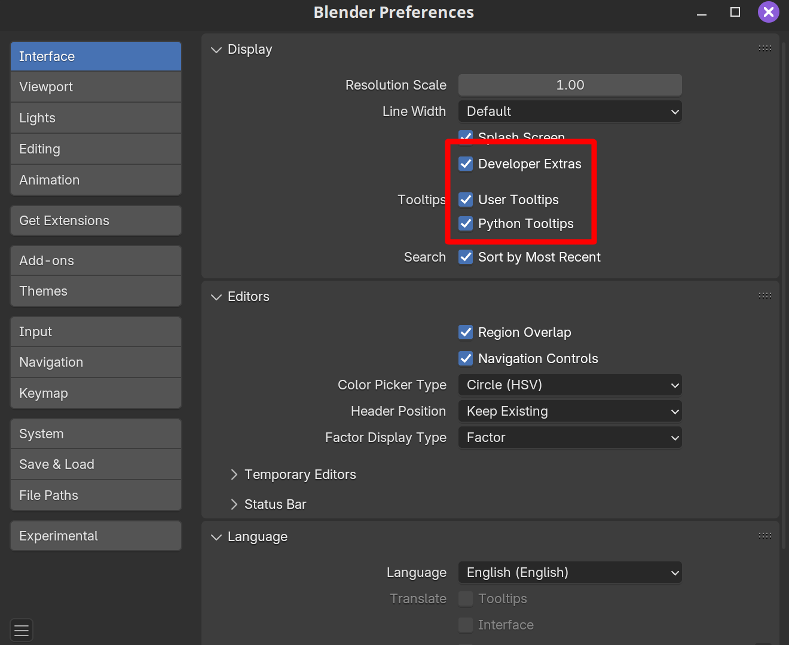
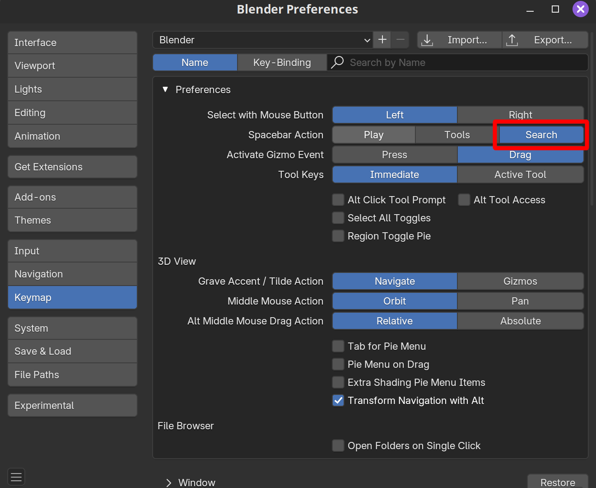
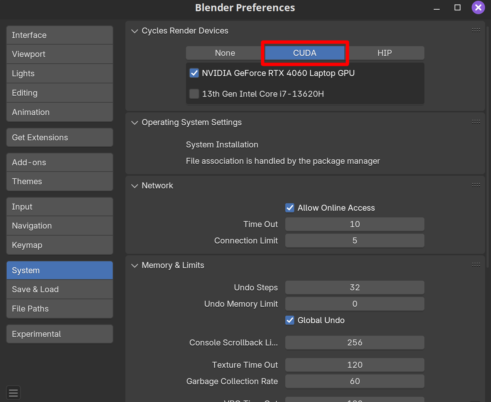
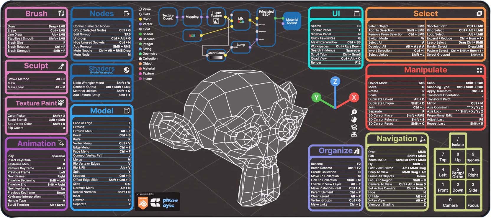

# cubs
#### A collection of useful Blender scripts

# How to use

In general, these can be imported through Blender's text editor. 
However, most scripts (except those for geometry nodes) 
were written in a way that allows users to paste them into the Python console as well.

Scripts were written in Blender 4.2. If any of them break in future releases, please raise an issue.

# Other useful information

## Preferences

I would highly recommend editing the following preferences:

* If you are writing your own scripts, Python tooltips can help guide you towards the commands to use.

* Blender has a LOT of submenus, but you can change the purpose of the spacebar to a search function. 
No need to remember things as much!

* Don't forget to actually use your GPU for rendering!

## Other resources
* Silvia Sellán's blogposts: 
[Rendering a paper figure](https://www.silviasellan.com/posts/blender_figure/), 
[Rendering an animation](https://www.silviasellan.com/posts/blender_videos/),
[Rendering with Scripts](https://www.silviasellan.com/posts/blender_course_scripting/)
* [Hsueh-Ti Derek Liu's BlenderToolbox](https://github.com/HTDerekLiu/BlenderToolbox)
* [Shader Encyclopedia for Cycles](https://www.blenderguru.com/articles/cycles-shader-encyclopedia)

## Hotkeys

Here's a cheatsheet for the most common Blender hotkeys. Made by a user on r/blender who has since deleted their account.
