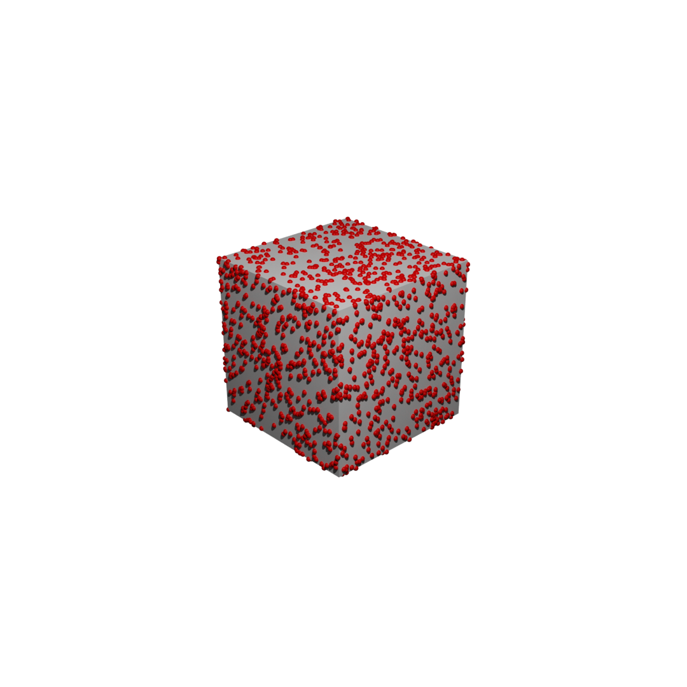
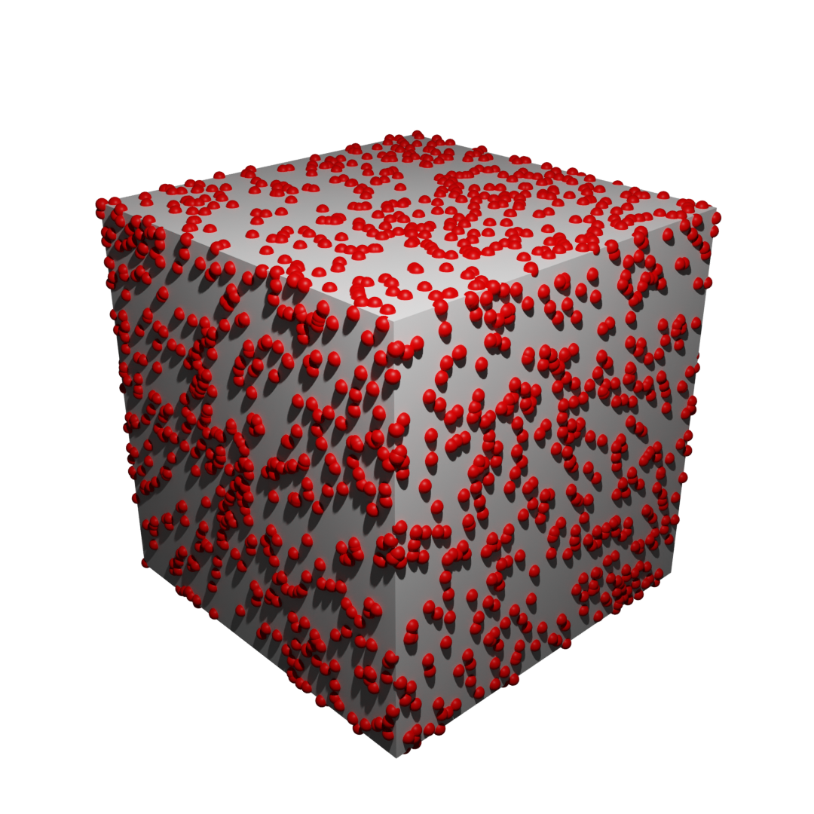
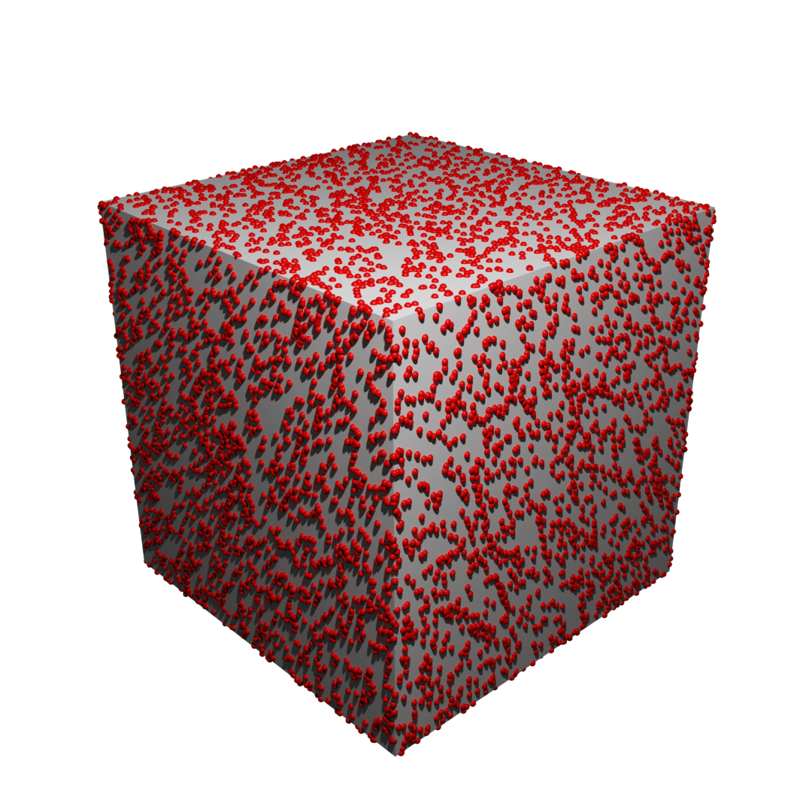

This folder is cugn, also known as a collection of useful geometry nodes. 

## How to use these nodes:
From Blender, open the text editor, open the file of your choice, then click run. 
This will automatically create the desired geometry node. All that's left is to apply it to the object of your choice.

The current list includes:
* **Sample Point From Mesh**: given an object, sample some points on it using either blue noise or white noise sampling.
* **Show Point Cloud**: given a point cloud (a collection of vertices), make it visible on renders.
* **Uneven Terrain**: given a point cloud sampled on a plane, generate varying heights and sphere radii make create rough terrain.  

## How to create your own:
These geometry nodes were created using the [Node to Python](https://extensions.blender.org/add-ons/node-to-python/) add-on.
This allows you to easily reuse any shader, geometry, or compositor nodes your create. Just make sure to manually add `bpy.data.scenes["Scene"].use_nodes = True`
to any compositor nodes you export this way.

## Some general warnings concerning scaling:
In Blender, nodes are applied in the _local_ coordinate frame. 
As such, if you rescale your object and then sample points from it, 
the density refers to the density of your object in its _unscaled form_:

  |  
:-------------------------:|:-------------------------:
Cube, original scale             |  Cube, x2 scale

For the scale to be applied properly, you must "Apply Scale"
( Ctrl + A ⟶ Scale, or `bpy.ops.object.transform_apply(location=False, rotation=False, scale=True)`)

  |  
:-------------------------:|:-------------------------:
x2 scale, not applied             |  x2 scale, applied

Notice how, once you apply scale, the radius of the spheres also returns to its original size.